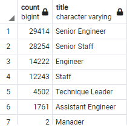

# Pewlett-Hackard-Analysis

## Overview of the analysis: 
   
   The purpose of this analysis was to utilize PostgreSQL to analyze employee data and determine the titles of current Pewlett-Hackard employees who will be retiring soon. After conducting this initial query and determining those results, another PostgreSQL analysis was undertaken. The second analysis examined employee data to determine which current employees would be eligible to be mentors based on their length of experience for a mentorship program at the company.

## Results: 
 
* There will be 29414 Senior Engineers retiring soon.
* There will be 28254 Senior Staff retiring soon.
* There will be 14222 Engineers retiring soon.
* There will be 12243 Staff retiring soon.
* There will be 4502	Technique Leaders retiring soon.
* There will be 1761	Assistant Engineers retiring soon.
* 2 Managers will be retiring soon. 
Enclosed is a chart containing the data below:

* 1549 employees are eligible for the mentorship program.

## Summary:
  
  As the "silver tsunami" begins to make an impact, 90398 employees will be needed to fill the roles of those employees who will be retiring. 
Unfortunately, there are not enough qualified, retirement-ready employees in the departments to mentor the next generation of Pewlett Hackard employees. There are only 1549 employees eligible for mentoring new employees, which is astronomically less than the number of new employees that need mentoring.

   There are additional queries that Pewlett_Hackard can undertake as they explore the options for their workforce. One query they can utlize is one that examines employees who are eligible for promotion, so they can take over for people who are retiring for the higher-up non-entry level positions. The data can be filtered based on amount of time employed in a certain position to see who is eligible for promotion from within the company. Another query that the company could utilize is one that adds departments to the retiring_titles table, since that would be beneficial in determining which departments need to focus the most on mentoring and training more people.   
